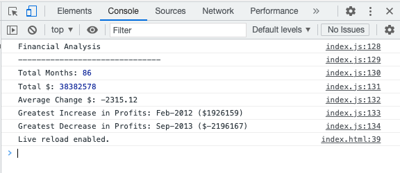

# Console Finances

## An application is live at https://ljenchik.github.io/Console-Finances/

A console application for analyzing the financial records of a company. The data are provided in starter/index.js in a form of a dataset composed of arrays with two fields, Date and Profit/Losses. My task was to calculate and display the corresponding values in the console:

* The total number of months included in the dataset

* The net total amount of Profit/Losses over the entire period

* The average of the **changes** in Profit/Losses over the entire period
  
* The greatest increase in profits (date and amount) over the entire period

* The greatest decrease in losses (date and amount) over the entire period

###

